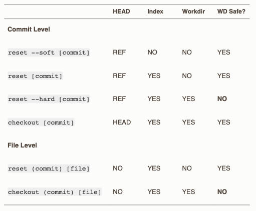

= Warsztaty git

== git reset

=== Wstęp

Komenda `reset` w gicie pozwala nam m.in. na cofanie zmian
przed wykonaniem migawki (np. gdy przypadkowo dodaliśmy pliki,
które nie miały znaleźć się w następnej migawce),
przesuwanie wskaźnika HEAD na poprzednie migawki.

https://git-scm.com/book/pl/v2/Podstawy-Gita-Cofanie-zmian[]

https://git-scm.com/book/pl/v2/Git-Tools-Reset-Demystified#_git_reset[]

=== Cofanie zmian po git add

- Zaincjalizuj repozytorium
- Utwórz plik a, b, c
- Dodaj pliki do repozytorium (`git add .`)
- Użyj `git status aby sprawdzić co zostało dodane
- Aby cofnąć zmiany (usunąć plik z poczekalni)
użyj `git reset [pliki]` lub `git reset` aby usunąć wszystkie zmiany
- Użyj git status aby sprawdzić co się zmieniło

=== Przesuwanie HEAD

- Wykonaj kilka migawek (możesz bazować na repozytorium z poprzedniego ćwiczenia,
warto jednak by pliki, które posiadasz w swoim repozytorium zmieniały się co migawkę
ważne dla kolejnego ćwiczenia)
- Gdy posiadasz już kilka migawek, spróbuj przesunąć wskaźnik HEAD na którąś z poprzednik migawek.
Aby tego dokonać użyj polecenia `git reset [identyfikator migawki]`.
Identyfikator migawki to pierwsze 5 znaków z jej klucza.
Możesz go sprawdzić za pomocą `git log`.
- Możesz również przenieść wskaźnik za pomocą komendy `git reset HEAD~[która migawka wstecz]`
, gdzie przekazujesz po tyldzie o ile migawek ma się przesunąć wskaźnik
(jeśli nie wpiszesz nic, przesunie o jedną wstecz).
- Po przesunięciu wskaźnika zwróć uwagę co tak naprawdę się zmienia. Sprawdź zawartość plików,
które zmieniały się w ciągu kolejnych migawek `cat [plik]`. Czy odpowiadają one temu co miałeś kilka migawek temu?
- Wypróbuj `git reset --[soft/mixed/hard] HEAD~`. Sprawdź co się zmienia między poszczególnymi.

=== Zmiana stanu na pliku na poprzednie migawki

-

== git reflog

=== Wstęp

Reflog to specjalna gałąź, która zapisuje informację o każdej pozycji HEAD w ciągu ostatnich 30 dni. Jest on przechowywany lokalnie, więc utracimy go klonując repozytorium.

- Aby wyświelić reflog należy uruchomic komendę `git reflog`

== git rerere